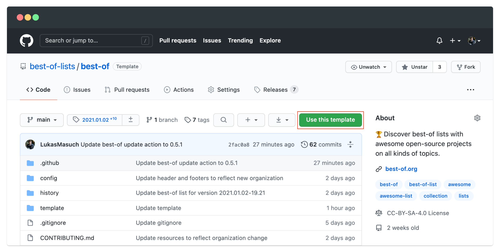
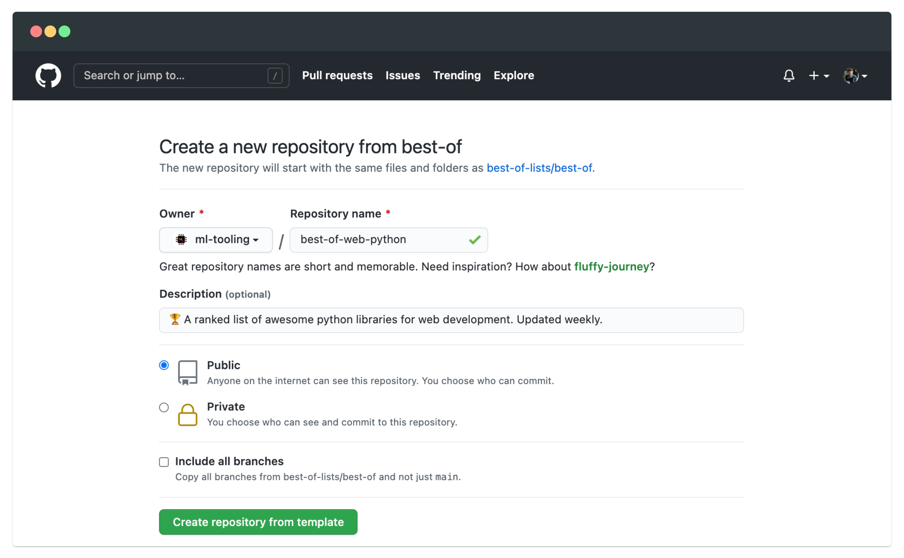
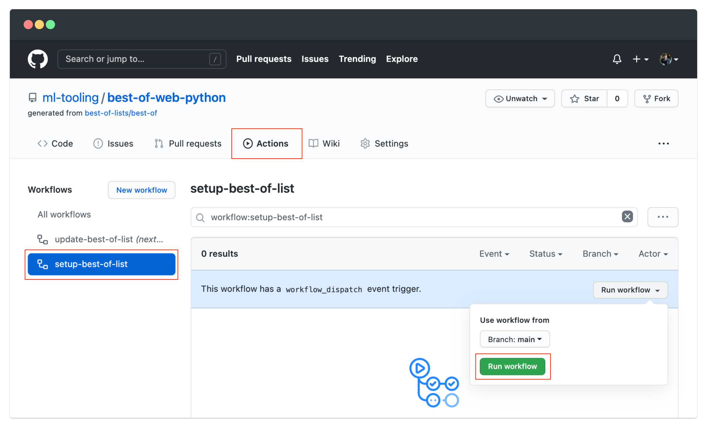
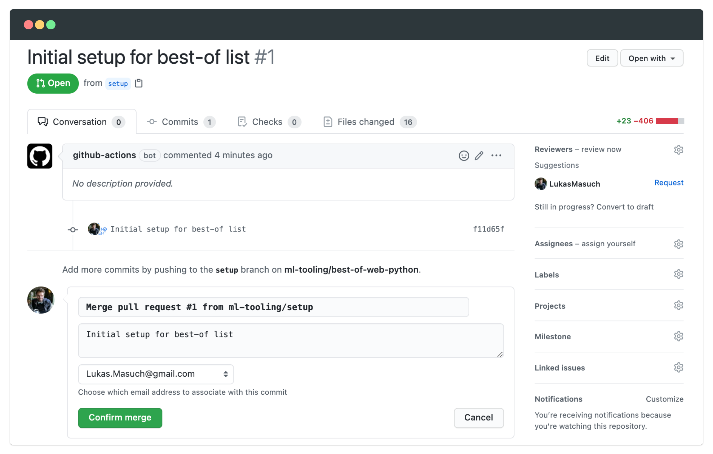
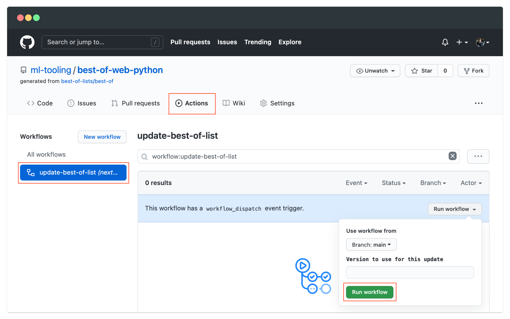
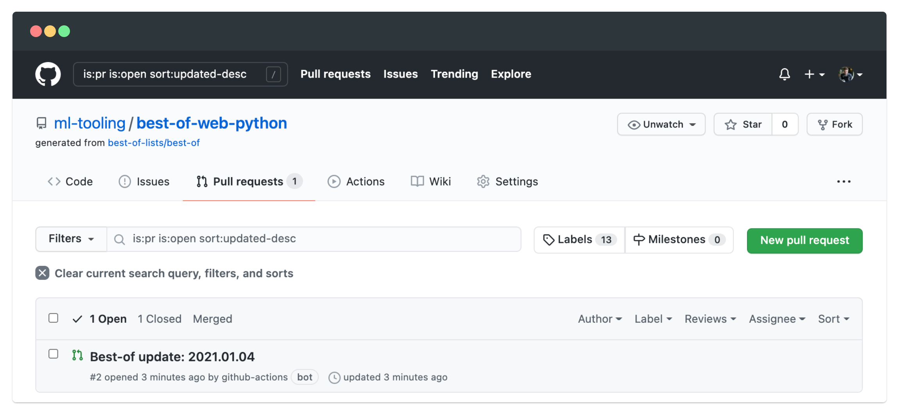

# Create your own best-of list

Welcome ❤️ It is awesome that you want to create your own best-of list! It will probably only take around 3-4 minutes to get you started ⏱️

1. **Create a new repository based on the [best-of template](https://github.com/best-of-lists/best-of/generate)**.
    

    
Screenshots (click to show...)

    
    

    

2. **Run the `setup-best-of-list` workflow**: `Actions` -> `setup-best-of-list` -> `Run workflow`
    

    
Screenshots (click to show...)

    

    

3. **Select and merge the setup pull request**: After about one minute, a pull request should appear in the `Pull requests` section -> Select the `Initial setup for best-of list` pull request -> Select `Merge Pull Request` -> `Confirm Merge`
    

    
Screenshots (click to show...)

    
    

    

4. **Run the `update-best-of-list` workflow**: `Actions` -> `update-best-of-list` -> `Run workflow` (you don't have to provide a version as input). The workflow will probably run for 2-3 minutes. Once it is finished, another pull request is created with the generated `README.md`. Merge the pull request and publish the draft release as instructed in the PR.
    

    
Screenshots (click to show...)

    
    

    

Congrats 🎉 you have created your own best-of list. Now you just need to fill it with some awesome projects into the `projects.yaml` as described in the [documentation](https://github.com/best-of-lists/best-of-generator#projects). After you added a few projects, you can either just manually rerun the `update-best-of-list` workflow to update the markdown page or wait for a few days until the scheduled action is run automatically. Keep in mind that the automated workflow also creates PRs for every update which you still need to merge manually. You can also start adapting the header and footer templates in `config/header.md` and `config/footer.md` to customize your list.

For more information on the `projects.yaml`, project properties or configuration, please refer to the [best-of-generator documentation](https://github.com/best-of-lists/best-of-generator#documentation).